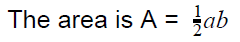
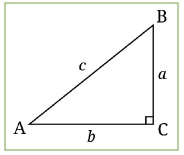
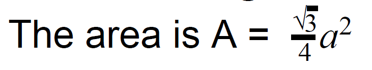
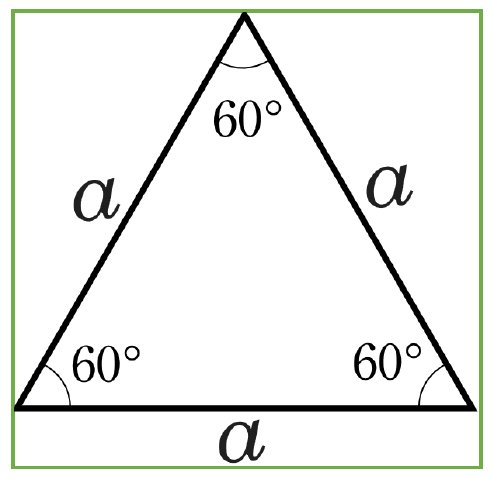
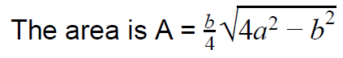
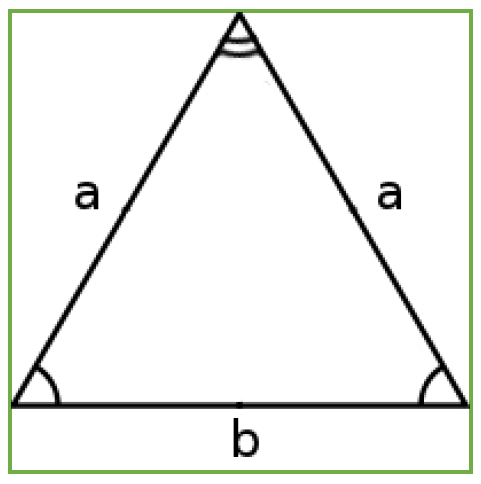

# Industry Mock Practical One

## MultiCalcApp description:

In this mock practical, you will create various variables, System.out... statements, method definitions and method calls that will calculate and output several things.

All code will be completed within the MultiCalcApp class which you will find within the `q1` package ( `src --> q1` ) . 

The steps for each task are outlined in the instructions and there are additional TODO comments (e.g., `TODO: comment...`) in the code to help you identify where to write your code. 

All tasks will require the creation of some code within the `start` method and some code within method definitions specific to the task. Task Four and Task Five require you to create the method definitions for that task. 

# Task One: Box volume calculator

### Task One A:

This part of the task will be completed within the `start` method.

Look for the `TODO: Your code for Task One A here:` comment and complete your code for this step there. 

For this task, you will need to create three variables of the data type double that will contain length, width and height.

You will also create a `System.out...` statement to output the values of the three variables to the console along with an appropriate message.

Then you will create a method call to the `printBoxVolume` method and pass the three variables into the method you created as parameters.  

**Steps for Task One A:**

- Create a variable named length of the data type double

- Create a variable named width of the data type double

- Create a variable named height of the data type double

- Assign default values to the two variables you created that will allow you to test your code

- Create a `System.out...` statement that will output the three variables along with an appropriate message
  
  - For example, the reulting output message could look like this `The length is: 10.4 metres, the width is 7.3 metres and the height is 2.2 metres.`

- Now create a call to the `printBoxVolume` method and pass the three vaiables you created into the method call as the three parameters for length, width and height. 
  
  - For example, `printBoxVolume(length, width, height);`

### Task One B:

This part of the task will be completed within the `printBoxVolume` method.

Look for the `TODO: Your code for Task One B here:` comment within the related method and complete your code for this step there.

For this step in the task, you will create the steps required to calculate the volume of the the box and then create a `System.out...` statement to output the volume of the box to the console with an appropriate output message.

**Steps for Task One B:**

- Within the `printBoxVolume` method, create a variable named volume of the data type double

- Use the length, width and height paramaters passed into the method to calculate the volume and assign the result to the volume variable you create
  
  - The formula for volume is `length *  width * height`

- Create a `System.out...` statement that outputs the volume along with an appropriate output message
  
  - For example, `The volume of the box is ??? cubic metres `

- Run your code and test that you can see all of the appropriate outputs

# Task Two: Right angle triangle

For this task, you will calculate the area of a right-angled triangle. A right-angled triangle is a triangle in which one angle is a right angle (that is, a 90-degree
angle). 

This is the formula for calculating the area of a right-angled triangle:

Right-angled triangle dioagram: 

### Task Two A:

This part of the task will be completed within the `start` method.

Look for the `TODO: Your code for Task Two A here:` comment and complete your code for this step there.

For this Task Two A you will create variables for two perpendicular sides of a right angled triangle. You will then create an output message to output the two sides with an appropriate message and then call the `printRightAngleTriangleArea` method using the two variables you created as the parameters in the method call. 

**Steps for Task Two A:**

- Create a variable named sideA of the data type double

- Create a variable named sideB of the data type double

- Assign default values to the two variables you created that will allow you to test your code

- Create a `System.out...` statement with an appropriate message to output the variables to the console
  
  - For example, `sidaA is 5.5 metres and sideB is 7.2 metres`

- Now create a call to the `printRightAngleTriangleArea` method and pass the two variables you created in as parameters

### Task Two B:

This part of the task will be completed within the `printRightAngleTriangleArea` method.

Look for the `TODO: Your code for Task Two B here:` comment within the related method and complete your code for this step there.

**Steps for Task Two B:**

- Within the `printRightAngleTriangleArea` method, create a new variable called area of the data type double

- Use the formula (  ) and the sideA and sideB parameters in the method to calculate the area of the triangle and assign the result to the area variable you created in the previous step

- Now create a `System.out...` statement to output the area of the triangle with an appropriate message
  
  - For example, `The area of the right-angled triangle is ??? square metres `

- Run your code and test that you can see all of the appropriate outputs

# Task Three: Degrees and rotations

### Task Three A:

This part of the task will be completed within the `start` method.

Look for the `TODO: Your code for Task Three A here:` comment and complete your code for this step there.

For Task Two A, you will create a variable to store a total number of degrees, output an appropriate message to display the variable to the console and then call the `printRotations` method

**Steps for Task Three A:**

- Create a variable called totalDegrees of the data type int

- Assign a value to this variable that is higher than 720 (720 is two full rotations)  

- Create a `System.out...` statement with an appropriate message to output the variable to the console
  
  - For example, `Number of degrees is 725`

- Now create a call to the `printRotations` method and pass in the totalDegrees variable as a parameter

### Task Three B:

This part of the task will be completed within the `printRotations` method.

Look for the `TODO: Your code for Task Three B here:` comment within the related method and complete your code for this step there.

For Task Three B, you will use a combination of integer division and modulus/remainder to convert the total degrees into rotations and degrees; for example, 725 degrees should be 2 rotations and 5 degrees. This is because there are 360 degrees in a full rotation, so 720 degress is 2 full rotations and there are 5 remaining degrees. 

**Steps for Task Three B:**

- Create a variable called rotations of the data type int 

- Use the method parameter totalDegrees to calculate the number of rotations and assign the result to the variable you created in the previous step
  
  - For example, 725 degrees should be 2 rotations

- Create a variable called remainingDegrees of the data type int

- Use the method parameter totalDegrees to calculate the remaining degrees and assign it to the variable you created in the previous step
  
  - For example, 725 degrees should be 5 remaining degrees

- Create a `System.out...` statement with an appropriate message to output the number of rotations and remaining degrees
  
  - For example, `725 total degrees is 2 full rotations and 5 remaining degrees`

- Run your code and test that you can see all of the appropriate outputs

# Task Four: Equilateral triangle

The task relates to calculating the area of an equilateral triangle. The details for equilateral triangles are included here below.

An equilateral triangle is a triangle in which all three sides (side a in the figure below) are equal.

The formula for calculating the area of an equilateral triangle is: 

Equilateral triangle diagram:

### Task Four A:

This part of the task will be completed within the `start` method.

Look for the `TODO: Your code for remaining tasks here:` comment and complete your code for this step there.

Because all three sides of an equilateral triangle are the same length, you will only need one length variable for this task. 

**Steps for Task Four A:**

- Create a variable named sideLength of the data type double
  
  - Because all three sides in an equilateral triangle are the same length, you only need this one variable to calculate the area

- Assign a value to the variable you created that will allow you to test your code

- Create a `System.out...` statement with an appropriate message that will output the variable
  
  - For example, `The length of the side is 24.5 metres`

- In Task Four B, you will create a method definition for a `printEquilateralTriangleArea` method; when you have completed the method definition, you will put a method call in the `start` method to pass the `sideLength` variable into the method and test your code

### Task Four B:

This part of the task will be completed within a `printEquilateralTriangleArea` method that you create.

You will create the method definition for this step. The method definition will be similar to the methods in the previous task; however, the method name and parameter should match the requirements of this task.

**Steps for Task Four B:**

- Create a method definition called `printEquilateralTriangleArea` that will take the `sideLength` variable you created in Task Four A as a parameter 
  
  - The method definition will be similar to the methods used in previous tasks but you must change the method and parameter names appropriately

- Inside the method definition you created in the previous step, create a variable called area of the data type double

- Use the formula outlined above to calculate the area by using the `sideLength` parameter in the method and assign the result to the `area` variable you created in the previous step

- Create a `System.out...` statement with an appropriate message to output the the area of the triangle
  
  - For example, `An equilateral triangle with a side length of 24.5 has an area of ??? square metres.`

- Go back to your start method can add a method call to the method you have just created and pass the appropriate variable as a  parameter into the method call

- Run your code and test that you can see all of the appropriate outputs

# Task Five: Isosceles triangle

The task relates to calculating the area of an isosceles triangle. The details for isosceles triangles are included here below. 

An isosceles triangle is a triangle that has two sides of equal length.

The formula for an isosceles triangle is:

Isosceles triangle diagram:

### Task Five A:

This part of the task will be completed within the `start` method.

Complete the code for this step within the start method after the code you wrote for the previous task.

**Steps for Task Five A:**

- Create a variable named equalSidesLength of the data type double

- Create a variable named singleSideLength of the data type double

- Assign some default data to these two variables so you can test your code

- Create a `System.out...` statement with an appropriate message that will output the variables
  
  - For example, `The length of the equal sides is 24.5 metres and the length of the single side is 20 metres`

- In Task Five B, you will create a method definition for a `printIsoscelesTriangleArea` method; when you have completed the method definition, you will put a method call in the `start` method to pass the `equalSidesLength` and `singleSideLength` variables into the method and test your code

### Task Five B:

This part of the task will be completed within a `printIsoscelesTriangleArea` method that you create.

You will create the method definition for this step. The method definition will be similar to the methods in the previous task; however, the method name and parameters should match the requirements of this task.

**Steps for Task Five B:**

- Create a method definition for a `printIsoscelesTriangleArea` method that will take `equalSidesLength` and `singleSideLength` parameters of the data type double. 

- Within the method you create, create a variable named `area` of the data type double 

- Use the `equalSidesLength` and `singleSideLength` parameters with the formula detailed above to calculate the area of the isosceles triangle and assign the result to the `area` variable you created in the previous step

- Create a `System.out...` statement with an appropriate message to output the the area of the triangle
  
  - For example, `An isosceles triangle with two equal sides of 24.5 metres and an odd side of 20 metres has an area of ??? square metres.`
- Run your code and test that you can see all of the appropriate outputs
